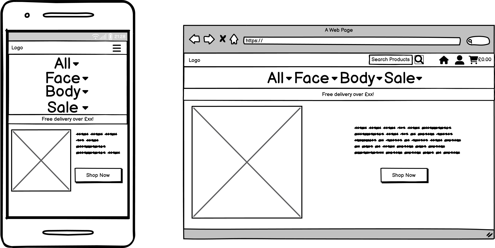
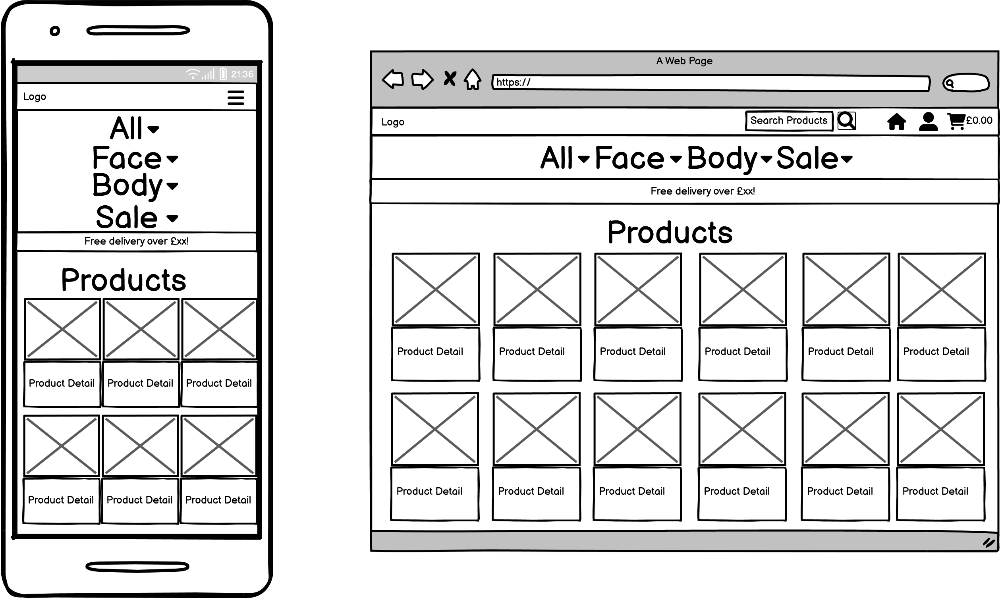
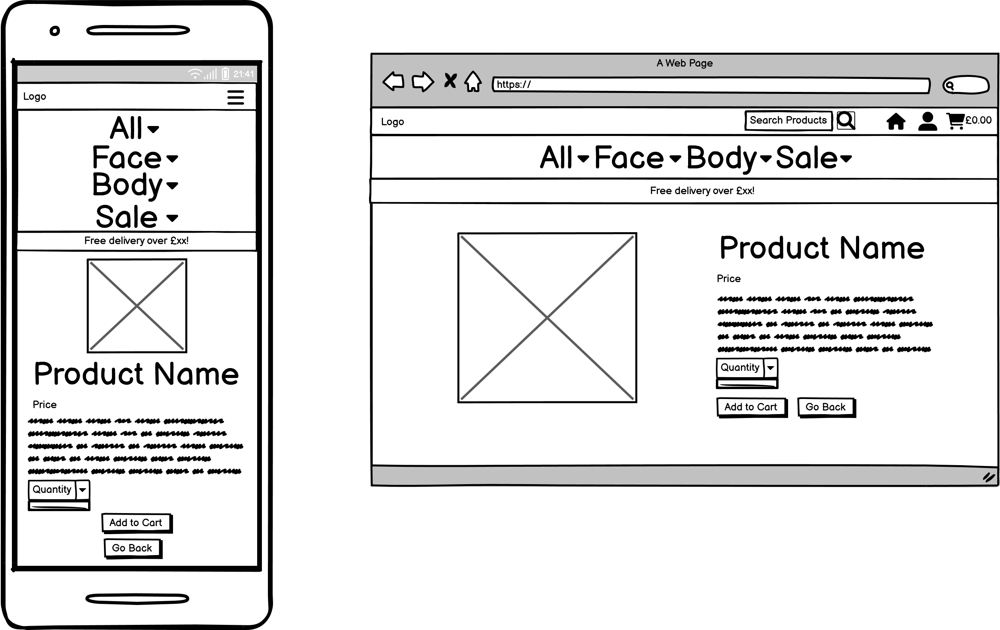
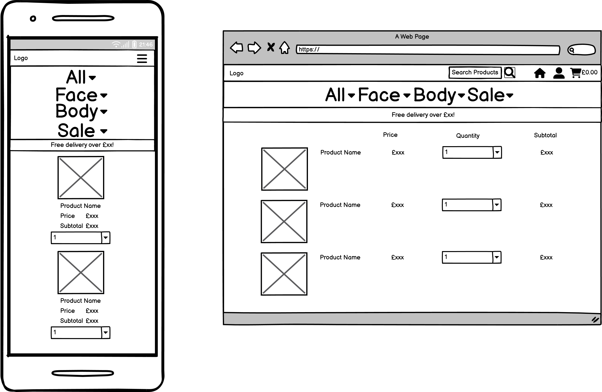
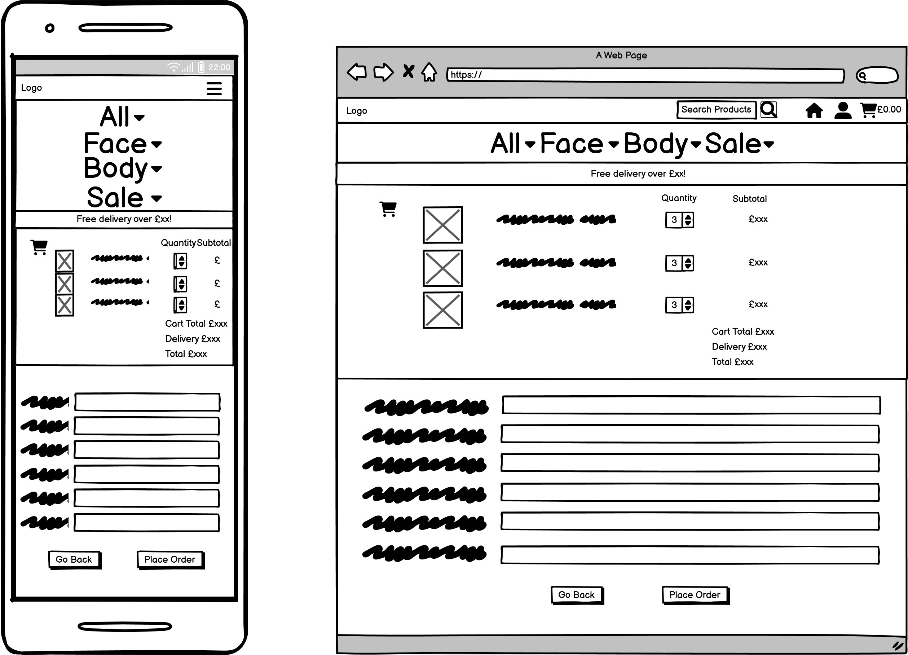
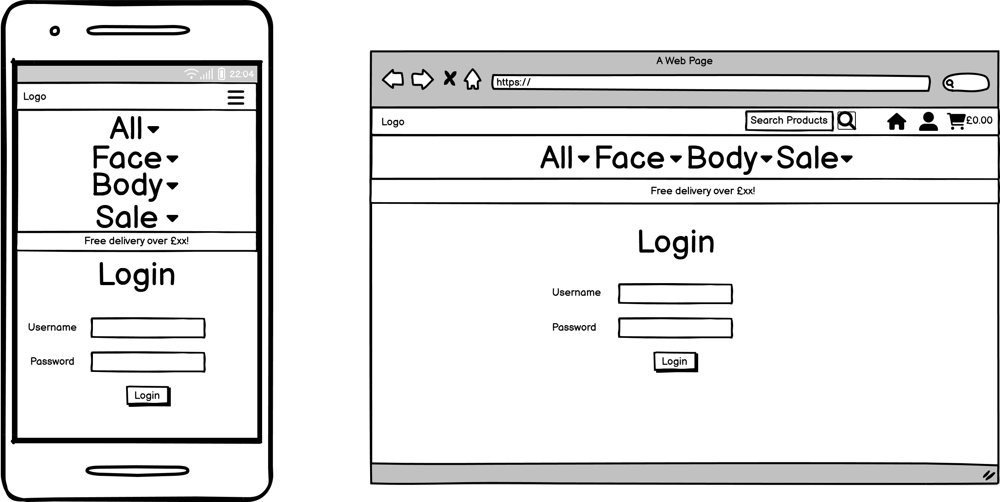
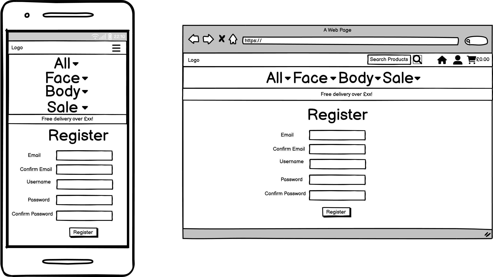

# APHROS Skincare Online Store

(Developer: Martyna Nowak)

[Live Webpage]()

## Table of Contents

1. [Project Goals](#project-goals)
    1. [Overview](#overview)
    2. [Goals](#goals)
2. [User Experience Design](#user-experience-design)
    1. [Strategy Plane](#strategy-plane)
    2. [Structure Plane](#structure-plane)
        1. [Website Structure](#website-structure)
        2. [Database Schema](#database-schema)
        3. [CRUD](#crud)
    3. [Surface Plane](#surface-plane)
        1. [Wireframes](#wireframes)
        2. [Typography](#typography)
        3. [Imagery](#imagery) 
        4. [Colour scheme](#colour-scheme)
3. [Features](#features)
    1. [Existing Features](#existing-features)
    2. [Future Features](#future-features)
4. [Technologies Used](#technologies-used)
    1. [Languages](#languages)
    2. [Frameworks and Tools](#frameworks-and-tools)
5. [Testing and bugs](#testing-and-bugs)
6. [Credits](#credits)
    1. [Media](#media)
    2. [Code used](#code-used)
    3. [Content](#content)
7. [Deployment](#deployment)
8. [Acknowledgements](#acknowledgements)

## Project Goals

### Overview

### Goals

## User Experience Design

### Strategy Plane

#### Target Audience

#### User Requirements and Expectations

#### User Stories

**As a User...**

| User Story     | ...I want to be able to... | ...so I can...  |
| :------------: |:--------------------------:| :--------------:|
| 1 | Easily navigate the website | Find products I want to buy |
| 2 | Use the website on any device and browser | Purcharse the items easily |
| 3 | Return to the home page without using the browser buttons if I encounter an error | Comfortably use the website |
| 4 | Receive feedback when interactning with the website | Know if my actions were succcessful |
| 5 | Filter products by type | Find specific products easily |
| 6 | Sort products by price | Find products that are within my budget |
| 7 | Sort products by reviews | Find out which products were enjoyed by other customers |
| 8 | Find more information about a specific product | Learn more about each product |
| 9 | Select the quantity | Buy the amount of products I need |
| 10 | View items in my cart | Check if I still want to buy the products |
| 11 | Amend the quantity before placing my order | Change my mind about the amount of products I need |
| 12 | Register an account | Have an account with the website |
| 13 | Receive a confirmation email | Know that my account was created successfully |
| 14 | Log in and out | Use my account |
| 15 | Reset a password | Access my account if I have forgotten my password |
| 16 | See my profile page | Set a default delivery address, see previous orders and my reviews |
| 17 | Leave a review | Provide my feedback |
| 18 | Read product reviews | Be informed of other shoppers experience with a product |
| 19 | Edit my reviews | Update my review if my opinion has changed |
| 20 | Add my delivery information easily | Place my order quickly |
| 21 | Store and update my delivery info | Make future purcharses easily |
| 22 | Add my payment info | Purcharse my order |
| 23 | My payments to be secure | Find the website trustworthy |
| 24 | Know how much the delivery costs | Know the total price |
| 25 | Add product to favourites | Remember which products I liked |
| 26 | Remove product from favourites | Remove a product I no longer like |
| 27 | View my favourites | Remember which products I liked |

**As a Website Administrator...**
| User Story     | ...I want to be able to... | ...so I can...  |
| :------------: |:--------------------------:| :--------------:|
| 28 | Add a product | Add new items to my store |
| 29 | Edit a product | Update product details |
| 30 | Delete a product | Remove items from the store |
| 31 | Delete a review | Remove reviews that contain innapropriate content |
| 32 | Easily find admin controls | Easily perform administrative actions |

### Structure Plane

#### Website Structure

The website structure targets the user stories as follows:

User Story 1: 

As a User I want to be able to easily navigate the website so I can find products I want to buy

* Navigation bar is displayed on all the pages; nav links are based on whether the user is logged in and if they are a superuser;
* The user is led through the site in an intuitive way:
    * The button on the index page leads to the all products page;
    * Clicking on a product picture or name leads to a relevant product detail page;
    * Clicking on a category name displays all products under that category;
    * The user can sort the products using the dropdown;
    * The cart can be accessed either by clicking the cart icon or the button on the toast which displays when a product is added to cart;
    * Log in page contains a link to Register page and vice versa;
    * If the user accessess the order confirmation from their profile page, a button to go back to the profile is displayed.

User Story 2: 

As a User I want to be able to use the website on any device and browser so I can purcharse the items easily

* The website is built with Bootstrap CSS and fully tested to ensure it is responsive on differend size devices

User Story 3: 

As a User I want to be able to return to the home page without using the browser buttons if I encounter an error so I can comfortably use the website

* Custom error pages are built for errors 400, 403, 404 and 500;
* Error pages contain a button leading the user back to the index page.

User Story 4: 

As a User I want to be able to receive feedback when interacting with the website so I can know if my actions were succcessful

* A toast is displayed every time the user performs a action to confirm whether the action was successful or not;
* A confirmation email is sent upon purcharse.

User Story 5: 

As a User I want to be able to filter products by type so I can find specific products easily

* Users can filter the products by category by using the navigation bar dropdown;
* Products can be sorted by category using a Sort by dropdown to the right;
* Clicking on a category name on All Products page displays all products within that category

User Story 6: 

As a User I want to be able to sort products by price so I can find products that are within my budget

* Products can be sorted by price using the navigation bar dropdown;
* Products can be sorted by price using a Sort by dropdown to the right;

User Story 7: 

As a User I want to be able to sort products by reviews so I can find out which products were enjoyed by other customers;

* Products can be sorted by average rating generated from reviews using the navigation bar dropdown;
* Products can be sorted by average rating generated from reviews using a Sort by dropdown to the right;

User Story 8: 

As a User I want to be able to find more information about a specific product so I can learn more about each product

* Information such as product ingredients and reviews is displayed if the user clicks on either product image or name.

User Story 9: 

As a User I want to be able to select the quantity so I can buy the amount of products I need

* Quantity can be selected on the Product Detail page before adding product to cart;

User Story 10: 

As a User I want to be able to view items in my cart so I can check if I still want to buy the products

* A table containing product image, name, quantity, price and subtotal is displayed on the Cart page;

User Story 11: 

As a User I want to be able to amend the quantity before placing my order so I can change my mind about the amount of products I need

* Quantity can be amended on the Cart page;

User Story 12: 

As a User I want to be able to register an account so I can have an account with the website

* The navbar contains a link to the Register page if the user is not logged in;
* User is prompted to create an account on the checkout page;

User Story 13: 

As a User I want to be able to receive a confirmation email so I can know that my account was created successfully

* Confirmation email is sent automatically when a new user registers;

User Story 14: 

As a User I want to be able to log in and out so I can use my account

* The navbar contains a link to the Log in page if the user is not logged in;
* User is prompted to log in on the checkout page;

User Story 15: 

As a User I want to be able to reset a password so I can access my account if I have forgotten my password

* User is able to reset their password by clicking a link on the logged in page;

User Story 16: 

As a User I want to be able to see my profile page so I can set a default delivery address and see previous orders

* The navbar contains a link to the profile page for logged in users;
* Order history is displayed on the profile page;
* Users can set default delivery address or amend an existing one.

User Story 17: 

As a User I want to be able to leave a review so I can provide my feedback

* Logged in users can leave a review using a button on the Product Detail Page
* When adding a new review, the user is asked to rate the product from 1 to 5;
* Average rating score is generated.

User Story 18: 

As a User I want to be able to read product reviews so I can be informed of other shoppers experience with a product.

* All users can access existing reviews for a product by clicking a button on the Product Detail page;

User Story 19: 

As a User I want to be able to edit my reviews so I can update my review if my opinion has changed

* Logged in users can edit their own reviews;

User Story 20: 

As a User I want to be able to add my delivery information easily so I can place my order quickly

* Users can input their delivery info on the Checkout page;

User Story 21: 

As a User I want to be able to store and update my delivery info so I can make future purcharses easily

* Logged in users are asked if they want to save their delivery info when making a purcharse;
* Preferred delivery info can be saved and amended on the Profile page.

User Story 22: 

As a User I want to be able to add my payment info so I can purcharse my order

* Stripe payment form is displayed on the Checkout page so users can easily make a card payment

User Story 23: 
 
As a User I want to be able to my payments to be secure so I can find the website trustworthy

* Stripe secure checkout functionallity is used;

User Story 24: 

As a User I want to be able to know how much the delivery costs so I can know the total price

* Delivery cost is displayed on the Cart Page, Checkout Page and toast which appears when the user adds a product to their cart;
* If the order total is under the Free Delivery Threshold, the amount they need to spend to get a free delivery is displayed.

User Story 25: 

As a User I want to be able to add product to favourites so I can remember which products I liked

* Logged in users can add a product to their favourites by clicking the heart icon on the Product Detail Page;

User Story 26: 

As a User I want to be able to remove product from favourites so I can remove a product I no longer like

* Logged in users can remove a product from favourites by clicking a button on the Favourites page;
* Logged in users can remove a product from favourites by clicking the heart icon on the Product Detail Pag;

User Story 27: 

As a User I want to be able to view my favourites so I can remember which products I liked

* Logged in users can see their favourites by accessing the Favourites page through the navbar user dropdown;

User Story 28:

As a Website Administrator I want to be able to add a product so I can add new items to my store

* Superusers can add a new product by clicking a link on the navbar user dropdown;
* Superusers can add a new product through the Django admin.

User Story 29:

As a Website Administrator I want to be able to edit a product so I can update product details

* Superusers can edit a product through clicking a button on the product card on the All Products Page or on the Product Detail page.
* Superusers can edit a product through Django Admin.

User Story 30:

As a Website Administrator I want to be able to delete a product so I can remove items from the store

* Superusers can delete a product through clicking a button on the product card on the All Products Page or on the Product Detail page;
* When clicking the button, a modal opens checking if the user truly intend to delete the product;
* Superusers can delete a product through Django Admin.

User Story 31:

As a Website Administrator I want to be able to easily find admin controls so I can easily perform administrative actions

* Add Product form can be found on the navbar;
* Edit and Delete product buttons are on the All Products cards and Product Details page;
* Administrative actions can be performed in Django admin.

#### Database Schema

#### CRUD

CRUD has been implemented as following:

1. Create

* Superusers can add a new product both in Django admin and within the website
* Logged in users can add reviews

2. Read

* Added products can be viewed straight away by all users
* Added reviews can be accessed by all users

3. Update

* Superusers can edit existing products both in Django admin and within the website, on the Products and Product Detail pages
* Logged in users can edit their own reviews

4. Delete

* Superusers can delete products in Django admin, on the Products Page and Product Detail page
* Logged in users can delete their own reviews
* Delete buttons open Modals which check if the user truly intends to delete a product or a review

### Surface Plane

#### Wireframes

Index Page

Products Page

Product Details Page

Cart Page

Checkout Page

Login Page

Register Page

#### Typography

#### Imagery

#### Colour Scheme

