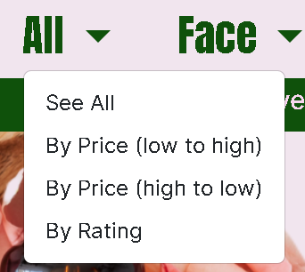
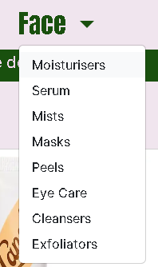
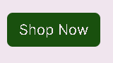
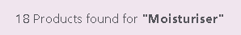
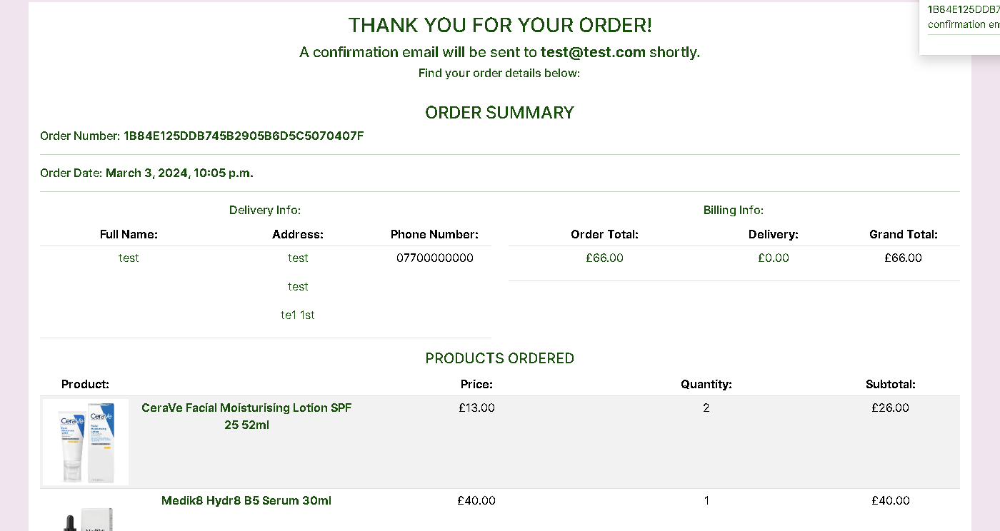
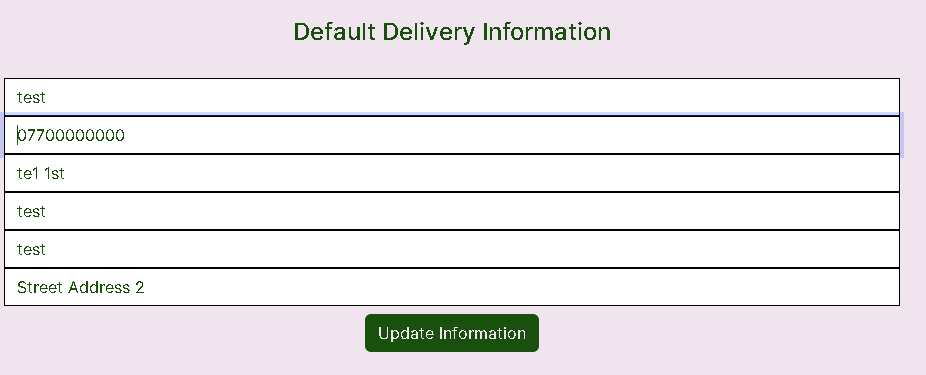
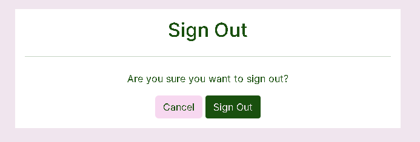

# APHROS Skincare Online Store

(Developer: Martyna Nowak)

[Live Webpage]()

## Table of Contents

1. [Project Goals](#project-goals)
    1. [Overview](#overview)
    2. [Goals](#goals)
2. [User Experience Design](#user-experience-design)
    1. [Strategy Plane](#strategy-plane)
    2. [Structure Plane](#structure-plane)
        1. [Website Structure](#website-structure)
        2. [Database Schema](#database-schema)
        3. [CRUD](#crud)
    3. [Surface Plane](#surface-plane)
        1. [Wireframes](#wireframes)
        2. [Typography](#typography)
        3. [Imagery](#imagery) 
        4. [Colour scheme](#colour-scheme)
3. [Features](#features)
4. [Technologies Used](#technologies-used)
    1. [Languages](#languages)
    2. [Frameworks and Tools](#frameworks-and-tools)
5. [Testing and bugs](#testing-and-bugs)
6. [Credits](#credits)
    1. [Media](#media)
    2. [Code used](#code-used)
    3. [Content](#content)
7. [Deployment](#deployment)
8. [Acknowledgements](#acknowledgements)

## Project Goals

### Overview

### Goals

## User Experience Design

### Strategy Plane

#### Target Audience

#### User Requirements and Expectations

#### User Stories

**As a User...**

| User Story     | ...I want to be able to... | ...so I can...  |
| :------------: |:--------------------------:| :--------------:|
| 1 | Easily navigate the website | Find products I want to buy |
| 2 | Use the website on any device and browser | Purcharse the items easily |
| 3 | Return to the home page without using the browser buttons if I encounter an error | Comfortably use the website |
| 4 | Receive feedback when interacting with the website | Know if my actions were succcessful |
| 5 | Filter products by type | Find specific products easily |
| 6 | Sort products by price | Find products that are within my budget |
| 7 | Sort products by reviews | Find out which products were enjoyed by other customers |
| 8 | Find more information about a specific product | Learn more about each product |
| 9 | Select the quantity | Buy the amount of products I need |
| 10 | View items in my cart | Check if I still want to buy the products |
| 11 | Amend the quantity before placing my order | Change my mind about the amount of products I need |
| 12 | Register an account | Have an account with the website |
| 13 | Receive a confirmation email | Know that my account was created successfully |
| 14 | Log in and out | Use my account |
| 15 | Reset a password | Access my account if I have forgotten my password |
| 16 | See my profile page | Set a default delivery address, see previous orders and my reviews |
| 17 | Leave a review | Provide my feedback |
| 18 | Read product reviews | Be informed of other shoppers experience with a product |
| 19 | Edit my reviews | Update my review if my opinion has changed |
| 20 | Add my delivery information easily | Place my order quickly |
| 21 | Store and update my delivery info | Make future purcharses easily |
| 22 | Add my payment info | Purcharse my order |
| 23 | My payments to be secure | Find the website trustworthy |
| 24 | Know how much the delivery costs | Know the total price |
| 25 | Add product to favourites | Remember which products I liked |
| 26 | Remove product from favourites | Remove a product I no longer like |
| 27 | View my favourites | Remember which products I liked |

**As a Website Administrator...**
| User Story     | ...I want to be able to... | ...so I can...  |
| :------------: |:--------------------------:| :--------------:|
| 28 | Add a product | Add new items to my store |
| 29 | Edit a product | Update product details |
| 30 | Delete a product | Remove items from the store |
| 31 | Easily find admin controls | Easily perform administrative actions |

### Structure Plane

#### Website Structure

The website structure targets the user stories as follows:

User Story 1: 

As a User I want to be able to easily navigate the website so I can find products I want to buy

* Navigation bar is displayed on all the pages; nav links are based on whether the user is logged in and if they are a superuser;
* The user is led through the site in an intuitive way:
    * The button on the index page leads to the all products page;
    * Clicking on a product picture or name leads to a relevant product detail page;
    * Clicking on a category name displays all products under that category;
    * The user can sort the products using the dropdown;
    * The cart can be accessed either by clicking the cart icon or the button on the toast which displays when a product is added to cart;
    * Log in page contains a link to Register page and vice versa;
    * If the user accessess the order confirmation from their profile page, a button to go back to the profile is displayed.

User Story 2: 

As a User I want to be able to use the website on any device and browser so I can purcharse the items easily

* The website is built with Bootstrap CSS and fully tested to ensure it is responsive on differend size devices

User Story 3: 

As a User I want to be able to return to the home page without using the browser buttons if I encounter an error so I can comfortably use the website

* Custom error pages are built for errors 400, 403, 404 and 500;
* Error pages contain a button leading the user back to the index page.

User Story 4: 

As a User I want to be able to receive feedback when interacting with the website so I can know if my actions were succcessful

* A toast is displayed every time the user performs a action to confirm whether the action was successful or not;
* A confirmation email is sent upon purcharse.

User Story 5: 

As a User I want to be able to filter products by type so I can find specific products easily

* Users can filter the products by category by using the navigation bar dropdown;
* Products can be sorted by category using a Sort by dropdown to the right;
* Clicking on a category name on All Products page displays all products within that category

User Story 6: 

As a User I want to be able to sort products by price so I can find products that are within my budget

* Products can be sorted by price using the navigation bar dropdown;
* Products can be sorted by price using a Sort by dropdown to the right;

User Story 7: 

As a User I want to be able to sort products by reviews so I can find out which products were enjoyed by other customers;

* Products can be sorted by average rating generated from reviews using the navigation bar dropdown;
* Products can be sorted by average rating generated from reviews using a Sort by dropdown to the right;

User Story 8: 

As a User I want to be able to find more information about a specific product so I can learn more about each product

* Information such as product ingredients and reviews is displayed if the user clicks on either product image or name.

User Story 9: 

As a User I want to be able to select the quantity so I can buy the amount of products I need

* Quantity can be selected on the Product Detail page before adding product to cart;

User Story 10: 

As a User I want to be able to view items in my cart so I can check if I still want to buy the products

* A table containing product image, name, quantity, price and subtotal is displayed on the Cart page;

User Story 11: 

As a User I want to be able to amend the quantity before placing my order so I can change my mind about the amount of products I need

* Quantity can be amended on the Cart page;

User Story 12: 

As a User I want to be able to register an account so I can have an account with the website

* The navbar contains a link to the Register page if the user is not logged in;
* User is prompted to create an account on the checkout page;

User Story 13: 

As a User I want to be able to receive a confirmation email so I can know that my account was created successfully

* Confirmation email is sent automatically when a new user registers;

User Story 14: 

As a User I want to be able to log in and out so I can use my account

* The navbar contains a link to the Log in page if the user is not logged in;
* User is prompted to log in on the checkout page;

User Story 15: 

As a User I want to be able to reset a password so I can access my account if I have forgotten my password

* User is able to reset their password by clicking a link on the logged in page;

User Story 16: 

As a User I want to be able to see my profile page so I can set a default delivery address and see previous orders

* The navbar contains a link to the profile page for logged in users;
* Order history is displayed on the profile page;
* Users can set default delivery address or amend an existing one.

User Story 17: 

As a User I want to be able to leave a review so I can provide my feedback

* Logged in users can leave a review using a button on the Product Detail Page
* When adding a new review, the user is asked to rate the product from 1 to 5;
* Average rating score is generated.

User Story 18: 

As a User I want to be able to read product reviews so I can be informed of other shoppers experience with a product.

* All users can access existing reviews for a product by clicking a button on the Product Detail page;

User Story 19: 

As a User I want to be able to edit my reviews so I can update my review if my opinion has changed

* Logged in users can edit their own reviews;

User Story 20: 

As a User I want to be able to add my delivery information easily so I can place my order quickly

* Users can input their delivery info on the Checkout page;

User Story 21: 

As a User I want to be able to store and update my delivery info so I can make future purcharses easily

* Logged in users are asked if they want to save their delivery info when making a purcharse;
* Preferred delivery info can be saved and amended on the Profile page.

User Story 22: 

As a User I want to be able to add my payment info so I can purcharse my order

* Stripe payment form is displayed on the Checkout page so users can easily make a card payment

User Story 23: 
 
As a User I want to be able to my payments to be secure so I can find the website trustworthy

* Stripe secure checkout functionallity is used;

User Story 24: 

As a User I want to be able to know how much the delivery costs so I can know the total price

* Delivery cost is displayed on the Cart Page, Checkout Page and toast which appears when the user adds a product to their cart;
* If the order total is under the Free Delivery Threshold, the amount they need to spend to get a free delivery is displayed.

User Story 25: 

As a User I want to be able to add product to favourites so I can remember which products I liked

* Logged in users can add a product to their favourites by clicking the heart icon on the Product Detail Page;

User Story 26: 

As a User I want to be able to remove product from favourites so I can remove a product I no longer like

* Logged in users can remove a product from favourites by clicking a button on the Favourites page;
* Logged in users can remove a product from favourites by clicking the heart icon on the Product Detail Pag;

User Story 27: 

As a User I want to be able to view my favourites so I can remember which products I liked

* Logged in users can see their favourites by accessing the Favourites page through the navbar user dropdown;

User Story 28:

As a Website Administrator I want to be able to add a product so I can add new items to my store

* Superusers can add a new product by clicking a link on the navbar user dropdown;
* Superusers can add a new product through the Django admin.

User Story 29:

As a Website Administrator I want to be able to edit a product so I can update product details

* Superusers can edit a product through clicking a button on the product card on the All Products Page or on the Product Detail page.
* Superusers can edit a product through Django Admin.

User Story 30:

As a Website Administrator I want to be able to delete a product so I can remove items from the store

* Superusers can delete a product through clicking a button on the product card on the All Products Page or on the Product Detail page;
* When clicking the button, a modal opens checking if the user truly intend to delete the product;
* Superusers can delete a product through Django Admin.

User Story 31:

As a Website Administrator I want to be able to easily find admin controls so I can easily perform administrative actions

* Add Product form can be found on the navbar;
* Edit and Delete product buttons are on the All Products cards and Product Details page;
* Administrative actions can be performed in Django admin.

#### Database Schema

**Models**

The website uses a relational database model using Postgres (SqLite and PostgreSQL DB by Code Institute) features models adapted from the CI Boutique Ado walkthrough as well as two original models - Reviews and Favourites. Below is the breakdown of all models included.

Order Model

| Field | Field Type | Validation | null | blank | default | on_delete |
| :---: |:----------:| :--------: | :--: | :---: | :-----: | :-------: |
| order_number | CharField | max_length=32 | False | n/a | n/a | n/a |
| user_profile | ForeignKey | n/a | True | True | n/a | SET_NULL |
| full_name | CharField | max_length=50 | False | False | n/a | n/a |
| email | EmailField | max_length=254 | False | False | n/a | n/a |
| phone_number | CharField | max_length=20 | False | False | n/a | n/a |
| postcode | CharField | max_length=20 | False | False | n/a | n/a |
| town_or_city | CharField | max_length=40 | False | False | n/a | n/a |
| street_address1 | CharField | max_length=80 | False | False | n/a | n/a |
| street_address2 | CharField | max_length=80 | True | True | n/a | n/a |
| date | DateTimeField | n/a | n/a | n/a | n/a | n/a |
| delivery_cost | DecimalField | max_digits=6, decimal_places=2 | False | n/a | 0 | n/a |
| order_total | DecimalField | max_digits=10, decimal_places=2 | False | n/a | 0 | n/a | 
| grand_total | DecimalField | max_digits=10, decimal_places=2 | False | n/a | 0 | n/a | 
| original_cart | TextField | n/a | False | False | '' | n/a |
| stripe_pid | TextField | max_length=254 | False | False | '' | n/a |

OrderLineItem Model

| Field | Field Type | Validation | null | blank | default | on_delete |
| :---: |:----------:| :--------: | :--: | :---: | :-----: | :-------: |
| order | ForeignKey | n/a | False | False | n/a | Cascade |
| product | ForeignKey | n/a | False | False | n/a | Cascade |
| quantity | IntegerField | n/a | False | False | 0 | n/a |
| lineitem_total | DecimalField | max_digits=6, decimal_places=2| False | False | n/a | n/a |

Favourites Model

| Field | Field Type | Validation | null | blank | default | on_delete |
| :---: |:----------:| :--------: | :--: | :---: | :-----: | :-------: |
| product | ManyToManyField | n/a | n/a | True | n/a | n/a |
| username | OneToOneField | n/a | n/a | n/a | n/a | Cascade |

Category Model

| Field | Field Type | Validation | null | blank | default | on_delete |
| :---: |:----------:| :--------: | :--: | :---: | :-----: | :-------: |
| category | CharField | max_length=254 | n/a | n/a | n/a | n/a |
| product_type_name | CharField | max_length=254 | True | True | n/a | n/a |

Product Model

| Field | Field Type | Validation | null | blank | default | on_delete |
| :---: |:----------:| :--------: | :--: | :---: | :-----: | :-------: |
| category | ForeignKey | n/a | True | True | n/a | SET_NULL |
| product_name | CharField | max_length=254 | n/a | n/a | n/a | n/a |
| product_img | ImageField | n/a | n/a | n/a | n/a | n/a |
| ingredients | TextField | n/a | n/a | n/a | n/a | n/a |
| price | DecimalField | max_digits=6, decimal_places=2 | n/a | n/a | n/a | n/a |
| rating | IntegrerField | MaxValue=5, MinValue=0 | True | True | 0 | n/a |

User Model

User Model was created using the <a href ="https://docs.allauth.org/en/latest/">Django Allauth library</a>

UserProfile Model

| Field | Field Type | Validation | null | blank | default | on_delete |
| :---: |:----------:| :--------: | :--: | :---: | :-----: | :-------: |
| user | OneToOneField | n/a | n/a | n/a | n/a | Cascade |
| default_full_name | CharField | max_length=20 | True | True | n/a | n/a |
| default_phone_number | CharField | max_length=20 | True | True | n/a | n/a |
| default_postcode | CharField | max_length=20 | True | True | n/a | n/a |
| default_town_or_city | CharField | max_length=40 | True | True | n/a | n/a |
| default_street_address1 | CharField | max_length=80 | True | True | n/a | n/a |
| default_street_address2 | CharField | max_length=80 | True | True | n/a | n/a |

Review Model

| Field | Field Type | Validation | null | blank | default | on_delete |
| :---: |:----------:| :--------: | :--: | :---: | :-----: | :-------: |
| product | ForeignKey | n/a | True | True | n/a | Cascade |
| user | ForeignKey | n/a | True | True | n/a | Cascade |
| date | DateField | n/a | False | False | n/a | n/a |
| title | CharField | max_length=50 | n/a | n/a | n/a | n/a |
| content | TextField | max_length=500 | n/a | n/a | n/a | n/a |
| rating | IntegrerField | MaxValue=5, MinValue=1 | False | False | 0 | n/a |

#### CRUD

CRUD has been implemented as following:

1. Create

* Superusers can add a new product both in Django admin and within the website
* Logged in users can add reviews

2. Read

* Added products can be viewed straight away by all users
* Added reviews can be accessed by all users

3. Update

* Superusers can edit existing products both in Django admin and within the website, on the Products and Product Detail pages
* Logged in users can edit their own reviews

4. Delete

* Superusers can delete products in Django admin, on the Products Page and Product Detail page
* Logged in users can delete their own reviews
* Delete buttons open Modals which check if the user truly intends to delete a product or a review

### Surface Plane

#### Wireframes

Index Page

Products Page

Product Details Page

Cart Page

Checkout Page

Login Page

Register Page

#### Typography

#### Imagery

#### Colour Scheme

## Features

### All Pages

**Navigation Bar**

* Fully responsive; collapapses into a toggler menu on small devices;

* Features a logo which leads to the Index page when clicked;
* Logo changes colour on hover;

* Features links to Index Page and Cart;
* For logged out users, features links to Register and Log in pages;

* For logged in users, features links to Profile and Favourites pages;
* For superusers, features a link to Add Product page.

* Contains a search form.
* Products can be found by either their name or ingredients.

* Contains the order total.

**User Stories covered:** 1, 2, 12, 14, 27

**Product Dropdown**

* Features three sections: All, Face, and Body

* The 'All' dropdown allows the user to See All Products, sort by price, and sort by rating

* The Face dropdown allows users to see products in following categories: Moisturisers, Serum, Masks, Mists, Peels, Eye Care, Cleansers, Exfoliators.

* The Body dropdown allows users to see products in following categories: Body Wash, Bath Oils, Bath Salts.

**User Stories covered:** 1, 5, 6, 7

**Free delivery banner**

* Advises the user on the free delivery threshold

**User stories covered:** 24

**Footer**

* Contains copyright and a link to the author's github

**Toasts**

* Appear when user performs an action.
* Provide feedback on said action.

**User Stories covered:** 4

### Index Page

* Contains an image consistent with the site branding

* Contains a button leading to the All Products page

**User stories covered**: 1

### All Products Page

**Product Cards**

* Display product image, name, rating if exists, and price
* Clicking on a picture or a product name leads to a Product Detail Page

* For the superusers, they contain Edit and Delete buttons

* Clicking on a category name leads to a page displaying all products in that category.

**User Stories covered:** 5, 29, 30

**Sort by... dropdown**

* Allows users to sort the products by:
    * Price (low to high)
    * Price (high to low)
    * Name (A-Z)
    * Name (Z-A)
    * Category (A-Z)
    * Category (Z-A)
    * Rating (high to low)

**User Stories covered:** 5, 6, 7

**Category page**

* Shows products within one category
* Accessed either by clicking on a category name on a product card or selecting a category in the dropdown
* Features a category name

* Features a product count

* Products can be sorted by price, name or rating using the Sort by... dropdown

**User Stories covered:** 5

**Products query**

* When user inputs a query into the search form in the navigation bar, all relevant product cards are displayed

**User stories covered:** 1, 8

**Back to top button**

* Takes user back to the top of the page

**User stories covered:** 1

### Product Detail Page

* Displays product image, name, category, rating if any, and ingredients

**User Stories covered:** 8

**Add to Cart button**

* Adds a product to a cart
* Accompanied by a quantity selector

**User Stories covered:** 9

**Added to Cart toast**

* Appears when a product is added to the card
* Shows items in cart
* Shows total price
* Shows how much the user must spent to get free delivery
* Features a link to the Cart Page

**User Stories covered**: 4, 10, 

**Add to Favourites icon**

* Appears to logged in users

* Changes depending on if the product is already in favourites or not
* If the product is already in favourites, it can be removed by clicking the icon

* Adding the product to favourites is confirmed by a toast

**User Stories covered:** 4, 25, 26

**Reviews buttons**

* All users can see the See Product Reviews button which leads to the Reviews page
* Logged in users can see the Add Review button which leads to the Add Review page

**User Stories covered:** 17, 18

**Product Admin buttons**

* Visible to superusers
* Edit button leads to Edit Product page
* Delete button opens a modal which confirms if the user truly intends to delete a product
* If the product is deleted, a success toast appears

**User Stories covered:** 4, 29, 30 

### Add Product Page

* Available only to superusers
* All fields other than category and rating are mandatory

* After an image is selected, it's name is displayed

* If a product is added succesfully, its being confirmed by a toast

**User Stories covered:** 4, 28

### Edit Product Page

* Displays a form similar to the Add Product form
* Form is pre-populated with existing product details

* An existing image is displayed

* If the product is updated succesfully, a toast confirms it

**User Stories covered:** 4, 29

### Cart Page

* Features a table displaying product image, name, price, quantity and subtotal

* If the cart is empty, a link to Products page appears

* Product quantity can be updated

* Quantity cannot be less than 1 or more than 99
* Updating quantity is confirmed by toast

* Product can be removed from cart
* Removing a product is confirmed by toast

* Subtotal is diplayed for each product based on quantity

* Cart Total, Delivery price and Grand total are displayed

* Secure Checkout button opens the Checkout Page
* Keep Shopping button leads the user back to the Product page

**User Stories covered:** 4, 10, 11

### Checkout Page

* Features order summary
* Order summary contains product image and name, price, selected quantity and subtotal
* Card total, delivery price and grand total are displayed

* Features Delivery info form
* Contact Details section of the form contains full name, email address and phone number fields

* Delivery section contains Address Line 1, Address Line 2, Town or City and Postcode fields

* Logged in users can save the delivery info to their profile
* If delivery info is already saved, the form will be pre-populated

* Logged out users will be prompted to registed or sign in so they can save their details

* Form contains Stripe card element

* The amount the card is being charged is displayed

* Keep Shopping button takes the user back to the Products page
* Complete Order button submits the order request

* A spanner is displayed while the order is being processed

* Successfully placed order is confirmed by a toast and Checkout Success page

**User Stories covered:** 4, 20, 21, 22, 23, 24

### Checkout Success Page

* Appears when an order is successfully placed

* Confirms that the order has been placed and what email the confirmation will be sent to

* Order number and date are displayed

* Delivery and Billing info are displayed in a table
* Products ordered are displayed in a table

**User Stories Covered:** 4

### Profile Page

**Default Delivery Information** 

* Contains a form for users to input or update their default delivery information
* If the user selected to store their info upon checkout, the form will be pre-populated

* Users can update their default delivery information by clicking a button

**User Stories Covered:** 16, 20, 21

**Order History**

* A table displaying past orders, contains Order Number, Order Date, Items Ordered and Order Total

* Clicking on an order number leads the user to the past order confirmation

* Past order confirmation contain a button leading the user back to the Profile page

**User Stories covered:** 4, 16

### Favourites Page

* Available to logged in users
* Displays products added to favourites by the user

* Product cards contain Remove from Fevourites button

* Clicking on the button opens a modal to confirm the user's action

* Removing a product from favourites is confirmed by a toast

**User Stories Covered:** 4, 26, 27

### Reviews Page

* All users can see existing reviews for a product

* If there are no reviews yet, the user is encouraged to leave one 

* If the user is the one who added a review, they can either edit or delete it
* Clicking Delete Review opens a modal checking if the user truly intends to do it 

* Deleting a review is confirmed by a toast

* Clicking Edit Review takes the user to the edit review page

**User Stories covered:** 4, 18, 19

### Add a Review Page

* Accessible to logged in users
* Displays the product name and image

* Displays a review form
* The form contains Title, Content and Rating fields

*  The Go Back button takes the user back to the Product Detail page
* Submit button adds a review

* Adding a review successfully is confirmed by a toast

**User Stories Covered:** 4, 17

### Edit a Review Page

* Accessible if the user is logged in and is the author of the review
* Displays the product name and image
* A toast is displaying informing the user they are editing their review

* The form contains Title, Content and Rating fields
* The form is pre-populated with the existing review

* Update button updates the review

* Successfull action is confirmed by toast

**User Stories Covered:** 4, 19

### Register Page

* Contains an AllAuth form
* Fields include email, email confirmation, username, password and password confirmation
* If the user has an existing account, they are directed to the Log in Page

* A toast is displayed asking the user to confirm their email address

* Information is displayed asking the user to verify their email

* When user clicks on the link in the email, they are asked again to verify their email address

* Upon successful confimation, a toast is displayed

**User Stories Covered:** 12, 13

### Log in Page

* Contains an AllAuth Log in Form
* If the user does not have an account yet, they are asked to register
* User can save their log in information
* Contains a link to password recovery

**User Stories covered:** 14

### Log out Page

* Ask the user if they want to log out

* Logging out is confirmed by a toast

**User Stories covered:** 14

### Forgot Password Page

* Contains AllAuth Forgotten Password form

**User Stories covered:** 15

### Error Pages

* Displayed for Errors 400, 403, 404 and 500
* Contain a button leading the user back to the Index page

**User Stories covered:** 1, 3

