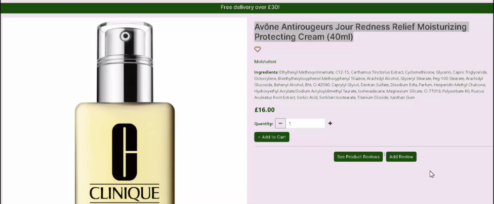

# APHROS Skincare Online Store

(Developer: Martyna Nowak)

[Live Webpage](https://aphros-4bc91bf82566.herokuapp.com/)

## Table of Contents

1. [Validation](#validation)
    1. [HTML Validation](#html-validation)
    2. [CSS Validation](#css-validation)
    3. [Python Linting](#python-linting)
    4. [JavaScript Linting](#javascript-linting)
    5. [Accessibility Testing](#accessibility-testing)
    6. [Performance Testing](#performance-testing)
2. [Manual Testing](#manual-testing)
    1. [Device Testing](#device-testing)
    2. [Browser compatibility](#browser-compatibility)
    3. [Testing User Stories](#testing-user-stories)
    4. [Feature Testing](#feature-testing)
3. [Bugs](#bugs)
    1. [Resolved](#resolved)
    2. [Unresolved](#unresolved)

## Validation

### HTML Validation

The W3C Markup Validation Service was used to validate the HTML of the website. All errors found were corrected, currently there are no errors.

See results:

* [Index Page](https://validator.w3.org/nu/?doc=https%3A%2F%2Faphros-4bc91bf82566.herokuapp.com%2F)
* [Products Page](https://validator.w3.org/nu/?doc=https%3A%2F%2Faphros-4bc91bf82566.herokuapp.com%2Fproducts%2F)
* [Product Detail Page](https://validator.w3.org/nu/?doc=https%3A%2F%2Faphros-4bc91bf82566.herokuapp.com%2Fproducts%2F2)
* [Add Product Page](https://validator.w3.org/nu/?doc=https%3A%2F%2Faphros-4bc91bf82566.herokuapp.com%2Fproducts%2Fadd%2F)
* [Edit Product Page](https://validator.w3.org/nu/?doc=https%3A%2F%2Faphros-4bc91bf82566.herokuapp.com%2Fproducts%2Fedit%2F2%2F)
* [Profile Page](https://validator.w3.org/nu/?doc=https%3A%2F%2Faphros-4bc91bf82566.herokuapp.com%2Fprofile%2F)
* [Cart Page](https://validator.w3.org/nu/?doc=https%3A%2F%2Faphros-4bc91bf82566.herokuapp.com%2Fcart%2F)
* [Checkout Page](https://validator.w3.org/nu/?doc=https%3A%2F%2Faphros-4bc91bf82566.herokuapp.com%2Fcheckout%2F)
* [Reviews Page](https://validator.w3.org/nu/?doc=https%3A%2F%2Faphros-4bc91bf82566.herokuapp.com%2Freviews%2Freviews%2F2%2F)
* [Add Review Page](https://validator.w3.org/nu/?doc=https%3A%2F%2Faphros-4bc91bf82566.herokuapp.com%2Freviews%2Fadd_review%2F2%2F)
* [Edit Review Page](https://validator.w3.org/nu/?doc=https%3A%2F%2Faphros-4bc91bf82566.herokuapp.com%2Freviews%2Fedit_review%2F12%2F)
* [Favourites Page](https://validator.w3.org/nu/?doc=https%3A%2F%2Faphros-4bc91bf82566.herokuapp.com%2Ffavourites%2Fview_favourites%2F)
* [Register Page](https://validator.w3.org/nu/?doc=https%3A%2F%2Faphros-4bc91bf82566.herokuapp.com%2Faccounts%2Fsignup%2F)
* [Log in Page](https://validator.w3.org/nu/?doc=https%3A%2F%2Faphros-4bc91bf82566.herokuapp.com%2Faccounts%2Flogin%2F)

### CSS Validation

[W3C CSS Validator](https://jigsaw.w3.org/css-validator/validator) was used to validate base.css, profile.css and checkout.css pages. No errors were found.

* Base.css

* Profile.css

* Checkout.css

### Python Linting

The following files were run through [https://pep8ci.herokuapp.com/](https://pep8ci.herokuapp.com/). Some minor errors such as lines too long and whitespace were found, they are now corrected.

| **APP** | **FILE** | **ERRORS** |
| --- | --- | --- |
| APHROS | settings.py | None |
| APHROS | urls.py | None |
| Cart | contexts.py | None |
| Cart | urls.py | None |
| Cart | views.py | None |
| Checkout | admin.py | None |
| Checkout | forms.py | None |
| Checkout | models.py | None |
| Checkout | signals.py | None |
| Checkout | urls.py | None |
| Checkout | views.py | None |
| Checkout | webhook_handler.py | None |
| Checkout | webhooks.py | None |
| Favourites | admin.py | None |
| Favourites | models.py | None |
| Favourites | urls.py | None |
| Favourites | views.py | None |
| Home | views.py | None |
| Home | urls.py | None |
| Products | admin.py | None |
| Products | forms.py | None |
| Products | models.py | None |
| Products | urls.py | None |
| Products | views.py | None |
| Products | widgets.py | None |
| Profiles | admin.py | None |
| Profiles | forms.py | None |
| Profiles | models.py | None |
| Profiles | views.py | None |
| Reviews | admin.py | None |
| Reviews | forms.py | None |
| Reviews | models.py | None |
| Reviews | views.py | None |

### JavaScript Linting

The two JavaScript files, toasts.js and stripe_elements.js as well as script blocks on individual pages were run through [https://jshint.com/](https://jshint.com/).
There were some missing semicolons, this has now been fixed and no errors are found.

### Accessibility Testing

[Index Page](https://wave.webaim.org/report#/https://aphros-4bc91bf82566.herokuapp.com/)
[Products Page](https://wave.webaim.org/report#/https://aphros-4bc91bf82566.herokuapp.com/products/)
[Product Detail Page](https://wave.webaim.org/report#/https://aphros-4bc91bf82566.herokuapp.com/products/2)
[Cart Page](https://wave.webaim.org/report#/https://aphros-4bc91bf82566.herokuapp.com/cart/)
[Checkout Page]

### Performance Testing

All pages were tested using Lighthouse in Google Chrome Developer Tools. Some pages has scored below 90 in Performance. This was due to following factors:

Products page scored poorly in Performance section. Product images are sized relative to the size of the root element. This was listed as one of the factors of the low Performance score.

Below are scores for individual pages:

**Index Page**

**Products Page**

**Product Detail Page**

**Add Product Page**

**Edit Product Page**

**Cart Page**

**Checkout Page**

**Checkout Success Page**

**Login Page**

**Log Out Page**

**Register Page**

**Profile Page**

**Favourites Page**

**Reviews Page**

**Add Review Page**

**Edit Review Page**

## Manual Testing

### Device Testing

Manual testing was done on following devices:

* Lenovo Thinkpad Yoga 460
* Redmi Note Pro 5g
* iPhone XR
* iPhone 14 Pro
* OPPO A78
* Dell 22 Monitor P2222H
* Google Chrome Developer Tools - all the different device avaliable, as well as all the size options

### Browser Compatibility

Manual Testing was done on the following browsers:

* Google Chrome
* Microsoft Edge
* Opera

### Testing User Stories

1. As a User I want to be able to easily navigate the website so I can find products I want to buy

| **Feature** | **Action** | **Expected Result** | **Actual Result** | **Works as expected** |
| --- | --- | --- | --- | --- |
| Navigation bar | Open all pages | Displayed on all pages | Navbar displayed correctly | Yes |
| Index button | Click on the button | Product page opens |  | Yes |
| Product name | Click on the name | Opens a relevant product detail page |  | Yes |
| Product picture | Click on the name | Opens a relevant product detail page |  | Yes |
| Category name | Click on the name | Shows products within relevant category |  | Yes |
| Sort dropdown | Select sorting method | Products sorted accordingly | Products sorted correctly | Yes |
| Cart button | Click on the icon | Opens the Cart page |  | Yes |
| Go to Secure Checkout button | Click on the button | Opens the Cart page |  | Yes |
| Log in page | Click on link | Opens the Register page |  | Yes |
| Register page | Click on button | Opens the Log in page |  | Yes |
| Past order page | Go to the past order confirmation | Contains a Back to Profile button |  | Yes |

2. As a User I want to be able to use the website on any device and browser so I can purcharse the items easily

| **Feature** | **Action** | **Expected Result** | **Actual Result** | **Works as expected** |
| --- | --- | --- | --- | --- |
| Whole website | Open on different sized devices | Everything displays correctly | Site responsive | Yes |

3. As a User I want to be able to return to the home page without using the browser buttons if I encounter an error so I can comfortably use the website

| **Feature** | **Action** | **Expected Result** | **Actual Result** | **Works as expected** |
| --- | --- | --- | --- | --- |
| Custom error pages | Trigger an error | Contains a link back to index page |  | Yes |

4. As a User I want to be able to receive feedback when interacting with the website so I can know if my actions were succcessful

| **Feature** | **Action** | **Expected Result** | **Actual Result** | **Works as expected** |
| --- | --- | --- | --- | --- |
| Toasts | Perform various actions | Toasts appear | Toasts appear correctly | Yes |
| Confirmation email | Place an order | Confirmation email sent |  | Yes |

5. As a User I want to be able to filter products by type so I can find specific products easily

| **Feature** | **Action** | **Expected Result** | **Actual Result** | **Works as expected** |
| --- | --- | --- | --- | --- |
| Navigation bar dropdown | Click on any category name | Displays products for that category |  | Yes |
| Sort by dropdown | Select Sort by Category | Sorts products alphabetically by the category name | Products sorted correctly | Yes |
| Category name | Click on a category name | Displays products in that category |  | Yes |

6. As a User I want to be able to sort products by price so I can find products that are within my budget

| **Feature** | **Action** | **Expected Result** | **Actual Result** | **Works as expected** |
| --- | --- | --- | --- | --- |
| Navigation bar dropdown | Click 'By Price' | Products sorted by price | Products sorted correctly | Yes |
| Sort by dropdown | Click 'By Price' | Products sorted by price | Products sorted correctly | Yes |

7. As a User I want to be able to sort products by reviews so I can find out which products were enjoyed by other customers;

| **Feature** | **Action** | **Expected Result** | **Actual Result** | **Works as expected** |
| --- | --- | --- | --- | --- |
| Navigation bar dropdown | Click 'By Rating' | Products sorted by price | Products sorted correctly | Yes |
| Sort by dropdown | Click 'By Rating' | Products sorted by price | Products sorted correctly | Yes |

8. As a User I want to be able to find more information about a specific product so I can learn more about each product

| **Feature** | **Action** | **Expected Result** | **Actual Result** | **Works as expected** |
| --- | --- | --- | --- | --- |
| Product name | Click on the name | Opens a relevant product detail page |  | Yes |
| Product picture | Click on the name | Opens a relevant product detail page |   | Yes |

9. As a User I want to be able to select the quantity so I can buy the amount of products I need

| **Feature** | **Action** | **Expected Result** | **Actual Result** | **Works as expected** |
| --- | --- | --- | --- | --- |
| Quantity selector | Select a quantity | Adds selected amount of products to cart |   | Yes |

10. As a User I want to be able to view items in my cart so I can check if I still want to buy the products

| **Feature** | **Action** | **Expected Result** | **Actual Result** | **Works as expected** |
| --- | --- | --- | --- | --- |
| Cart page | Go to Cart | A table containing product image, name, quantity, price and subtotal is displayed | Appears correctly | Yes |

11. As a User I want to be able to amend the quantity before placing my order so I can change my mind about the amount of products I need

| **Feature** | **Action** | **Expected Result** | **Actual Result** | **Works as expected** |
| --- | --- | --- | --- | --- |
| Cart page | Select quantity and click Update | Updates quantity |   | Yes |

12. As a User I want to be able to register an account so I can have an account with the website

| **Feature** | **Action** | **Expected Result** | **Actual Result** | **Works as expected** |
| --- | --- | --- | --- | --- |
| Register page | Create a new account | A new account is created | Works correctly | Yes |

13. As a User I want to be able to receive a confirmation email so I can know that my account was created successfully

| **Feature** | **Action** | **Expected Result** | **Actual Result** | **Works as expected** |
| --- | --- | --- | --- | --- |
| Confimation email | Create a new account | Confirmation email received |   | Yes |

14. As a User I want to be able to log in and out so I can use my account

| **Feature** | **Action** | **Expected Result** | **Actual Result** | **Works as expected** |
| --- | --- | --- | --- | --- |
| Log in page | Type in username and password | Logs the user in | Works correctly | Yes |

15. As a User I want to be able to reset a password so I can access my account if I have forgotten my password

| **Feature** | **Action** | **Expected Result** | **Actual Result** | **Works as expected** |
| --- | --- | --- | --- | --- |
| Reset password page | Type in email address | Receive an email with a link to reset password |   | Yes |

16. As a User I want to be able to see my profile page so I can set a default delivery address and see previous orders

| **Feature** | **Action** | **Expected Result** | **Actual Result** | **Works as expected** |
| --- | --- | --- | --- | --- |
| Profile page | Go to the Profile page | Default delivery address form is displayed | Form displayed | Yes |
| Profile page | Go to the Profile page | Order history table displayed | Table displayed | Yes |

17. As a User I want to be able to leave a review so I can provide my feedback

| **Feature** | **Action** | **Expected Result** | **Actual Result** | **Works as expected** |
| --- | --- | --- | --- | --- |
| Add Review Page | Open the page | Add review form displayed |   | Yes |
| Add Review Page | Fill out the form | A review added succesfully |  | Yes |

18. As a User I want to be able to read product reviews so I can be informed of other shoppers experience with a product.

| **Feature** | **Action** | **Expected Result** | **Actual Result** | **Works as expected** |
| Reviews page | Open the page | Reviews displayed if any |  | Yes |

19. As a User I want to be able to edit my reviews so I can update my review if my opinion has changed

| **Feature** | **Action** | **Expected Result** | **Actual Result** | **Works as expected** |
| --- | --- | --- | --- | --- |
| Edit Review Page | Open the page | Edit review form displayed |  | Yes |
| Edit Review Page | Fill out the form | The review updated succesfully |  | Yes |

20. As a User I want to be able to add my delivery information easily so I can place my order quickly

| **Feature** | **Action** | **Expected Result** | **Actual Result** | **Works as expected** |
| --- | --- | --- | --- | --- |
| Checkout page | Open the page | Delivery form displayed | Form displayed correctly | Yes |

21. As a User I want to be able to store and update my delivery info so I can make future purcharses easily

| **Feature** | **Action** | **Expected Result** | **Actual Result** | **Works as expected** |
| --- | --- | --- | --- | --- |
| Profile page | Open the profile page | Default delivery info form displayed | Form displayed | Yes |
| Profile page | Add preferred delivery details and click update | Default delivery info updated | Details saved | Yes |
| Checkout page | Tick the checkbox | Default delivery info saved | Information displayed on the profile page | Yes |

22. As a User I want to be able to add my payment info so I can purcharse my order

| **Feature** | **Action** | **Expected Result** | **Actual Result** | **Works as expected** |
| --- | --- | --- | --- | --- |
| Checkout page | Go to the checkout page | Stripe element displayed | Displayed correctly | Yes |

23. As a User I want to be able to my payments to be secure so I can find the website trustworthy

| **Feature** | **Action** | **Expected Result** | **Actual Result** | **Works as expected** |
| --- | --- | --- | --- | --- |
| Stripe | Make a payment | Payment is secure | Works correctly | Yes |

24. As a User I want to be able to know how much the delivery costs so I can know the total price

| **Feature** | **Action** | **Expected Result** | **Actual Result** | **Works as expected** |
| --- | --- | --- | --- | --- |
| Cart page | Go to the page | Delivery cost displayed | Appears correctly | Yes |
| Checkout page | Go to the page | Delivery cost displayed | Appears correctly | Yes |
| Toast | Add product to cart | Delivery cost displayed | Appears correctly | Yes |

25. As a User I want to be able to add product to favourites so I can remember which products I liked

| **Feature** | **Action** | **Expected Result** | **Actual Result** | **Works as expected** |
| --- | --- | --- | --- | --- |
| Product Detail page | Click the heart icon | Adds product to favourites |  | Yes |

26. As a User I want to be able to remove product from favourites so I can remove a product I no longer like

| **Feature** | **Action** | **Expected Result** | **Actual Result** | **Works as expected** |
| --- | --- | --- | --- | --- |
| Product Detail page | Click the heart icon | Removes product to favourites |  | Yes |
| My Favourites | Click Remove from Favourites | Opens a modal | Modal appears | Yes |
| My Favourites | Click the button | Removes product to favourites |  | Yes |

27. As a User I want to be able to view my favourites so I can remember which products I liked

| **Feature** | **Action** | **Expected Result** | **Actual Result** | **Works as expected** |
| --- | --- | --- | --- | --- |
| My Favourites | Go to the page | Favourite products displayed if any |  | Yes |

28. As a Website Administrator I want to be able to add a product so I can add new items to my store

| **Feature** | **Action** | **Expected Result** | **Actual Result** | **Works as expected** |
| --- | --- | --- | --- | --- |
| Navigation bar | Click Add Product | Opens Add Product Page | | Yes |
| Add Product Form | Fill out the form and click Add Product | A new Product added |  | Yes |
| Django Admin | Fill out the form and click Save | A new Product added |  | Yes |

29. As a Website Administrator I want to be able to edit a product so I can update product details

| **Feature** | **Action** | **Expected Result** | **Actual Result** | **Works as expected** |
| --- | --- | --- | --- | --- |
| Product Detail Page | Click Edit | Opens Edit Product Page |  | Yes |
| Products Page | Click Edit | Opens Edit Product Page |  | Yes |
| Edit Product Form | Fill out the form and click Update | Product info Updated |  | Yes |
| Django Admin | Select product and edit | Product info updated | Works correctly | Yes |

30. As a Website Administrator I want to be able to delete a product so I can remove items from the store

| **Feature** | **Action** | **Expected Result** | **Actual Result** | **Works as expected** |
| --- | --- | --- | --- | --- |
| Product Detail Page | Click Delete | Opens a modal to delete a product |  | Yes |
| Products Page | Click Edit | Opens a modal to delete a product |  | Yes |
| Django Admin | Select product and click delete | Product deleted | Works correctly | Yes |

31. As a Website Administrator I want to be able to easily find admin controls so I can easily perform administrative actions

| **Feature** | **Action** | **Expected Result** | **Actual Result** | **Works as expected** |
| --- | --- | --- | --- | --- |
| Navbar | Click on Add Product | Add Product Page Displays | Works correctly | Yes |
| Product Detail Page | Go to the page | Edit and Deleta buttons displayed | Displayed correctly | Yes |
| Products Page | Go to the page | Edit and Deleta buttons displayed | Displayed correctly | Yes |
| Django Admin | Go to Django Admin | Administrative functions work | Works correctly | Yes |

### Feature Testing

**All Pages**

| **Feature** | **Expected Outcome** | **Testing Performed** | **Result** | **Pass/Fail** |
| --- | --- | --- | --- | --- |
| Navigation bar | Responsive | Test on various devices | Collapses on smaller screens | Pass |
| Logo | Leads to Index page when clicked on | Click on the logo | Leads to index page | Pass |
| Logo | Changes on hover | Hover the logo | Changes colour | Pass |
| Navbar links | Lead to relevant pages | Click on the links | Correct pages open | Pass |
| Search bar | Displays search queries | Input query into the form | Shows results for a given query | Pass |
| Order total | Correct order total displays | Add products to cart | Correct order total displays | Pass |
| Product dropdown | Shows product categories | Click on the dropdown | Displays product categories | Pass |
| Product dropdown | Displays products for a relevant category | Click on the dropdown links | Displays products for a relevant category | Pass |
| Free delivery banner | Shows a correct free delivery threshold | Open all pages | Free Delivery Threshold displayed | Pass |
| Footer | Displayed on all pages | Open all pages | Footer appears | Pass |
| Toasts | Appear after an action is performed | Perform | Correct order total displays | Pass |

**Index Page**

| **Feature** | **Expected Outcome** | **Testing Performed** | **Result** | **Pass/Fail** |
| --- | --- | --- | --- | --- |
| Image | Displays on load | Go to the index page | Image appears | Pass |
| Button | Opens the Product Page | Click on the button | Product page opens | Pass |

**Products Page**

| **Feature** | **Expected Outcome** | **Testing Performed** | **Result** | **Pass/Fail** |
| --- | --- | --- | --- | --- |
| Product cards | Display product image | Open the Products Page | Images appear | Pass |
| Product cards | Display product name and price | Open the Products Page | Names and prices appear | Pass |
| Rating div | Display average rating score if the product has any | Find a product with rating | Rating score appears | Pass |
| Product image | Clicking on the image opens a relevant product detail page | Click on the image | Correct Product Detail page opens | Pass |
| Product name | Clicking on the name opens a relevant product detail page | Click on the name | Correct Product Detail page opens | Pass |
| Admin buttons | Appear to the superuser | Log in as superuser | Buttons appear | Pass |
| Product image | Clicking on the image opens a relevant product detail page | Click on the image | Correct Product Detail page opens | Pass |
| Edit button | Opens a product edit page | Click on the button | Edit Product page opens for the correct product | Pass |
| Delete button | Opens a modal | Click on the button | Modal opens | Pass |
| Delete Modal button | Deletes a product | Click on the button | Product deleted | Pass |
| Toasts | Appear when a product is edited or deleted | Edit or delete a product | Toasts appear | Pass |
| Dropdown | Sort products | Select different sorting options | Products sorted correctly | Pass |
| Category page | Appears when clicked on a category name | Click a category name on a product card | Correct products appear | Pass |
| Category name | Appears on a category page | Click a category name on a product card | Correct name appears | Pass |
| Product count | Shows the amount of product within the categoy | Click a category name on a product card | Correct number appears | Pass |
| Product query | Shows relevant products | Type a query into the search bar | Correct products appear | Pass |
| Back to the top button | Takes user back to the top of the page | Click on the button | Works as expected | Pass |

**Product Details Page**

| **Feature** | **Expected Outcome** | **Testing Performed** | **Result** | **Pass/Fail** |
| --- | --- | --- | --- | --- |
| Product Detail page | Displays correct product information | Go to the Product Detail page for any product | Correct information displayed | Pass |
| Product rating | Displays average product rating if exists | Add a few reviews | Correct average rating displayed | Pass |
| Add to Cart button | Adds product to cart | Click on the button | Product added | Pass |
| Quantity selector | Select quantity | Add to cart | Correct quantity added | Pass |
| Add to Cart button | Min value is 1, max value is 99 | Try to add less than 1 or more than 99 products | Impossible to add | Pass |
| Added to Cart toast | Appears when a product is added to the cart | Add to cart | Toast appears | Pass |
| Added to Cart toast | Shows items in cart | Add to cart | Items displayed | Pass |
| Added to Cart toast | Shows total price | Add to cart | Total price correct | Pass |
| Added to Cart toast | Shows how much the user must spent to get free delivery | Add to cart | Works as expected | Pass |
| Added to Cart toast | Go to Secure Checkout button opens cart | Click on the button | Correct page opens | Pass |
| Add to Favourites icon | Adds or removes from favourites | Click on the icon | Works as expected | Pass |
| See Product Reviews Button | Leads to a relevant Reviews page | Click on the button | Correct page opens | Pass |
| Add Review Button | Leads to a relevant Add Review page | Click on the button | Correct page opens | Pass |
| Edit button | Opens a product edit page | Click on the button | Edit Product page opens for the correct product | Pass |
| Delete button | Opens a modal | Click on the button | Modal opens | Pass |
| Delete Modal button | Deletes a product | Click on the button | Product deleted | Pass |

**Add Product Page**

| **Feature** | **Expected Outcome** | **Testing Performed** | **Result** | **Pass/Fail** |
| --- | --- | --- | --- | --- |
| Product form | Loads all the fields | Go to the Add Product Page | Works as expected | Pass |
| Image field | Image name appears | Add image | Works as expected | Pass |
| Product form | Adds a new product | Fill out the form and click submit | New product added | Pass |

**Edit Product Page**

| **Feature** | **Expected Outcome** | **Testing Performed** | **Result** | **Pass/Fail** |
| --- | --- | --- | --- | --- |
| Product form | Fields prepopulated with existing information | Go to the Edit Product Page | Works as expected | Pass |
| Image field | Current image displayed | Go to the Edit Product Page | Works as expected | Pass |
| Product form | Updates the product | Fill out the form and click submit | Product updated | Pass |

**Cart Page**

| **Feature** | **Expected Outcome** | **Testing Performed** | **Result** | **Pass/Fail** |
| --- | --- | --- | --- | --- |
| Table | Display product image, name, price, quantity and subtotal | Add products to cart | Works as expected | Pass |
| Quantity selector | Updates product quantity | Change quantity and click Update | Works as expected | Pass |
| Quantity selector | Min value is 1, max value is 99 | Try to add less than 1 or more than 99 products | Impossible to add | Pass |
| Toast | Appears when quantity updated | Update quantity | Works as expected | Pass |
| Remove link | Removes product from cart | Click on | Works as expected | Pass |
| Toast | Appears when product removed | Remove product | Works as expected | Pass |
| Prices | Subtotal, Cart Total, Delivery and Grand Total show the correct amount | Add products to cart | Works as expected | Pass |
| Secure Checkout button | Opens the checkout page | Click on the button | Works as expected | Pass |

**Checkout Page**

| **Feature** | **Expected Outcome** | **Testing Performed** | **Result** | **Pass/Fail** |
| --- | --- | --- | --- | --- |
| Order Summary | Displays correct details | Add products to cart and go to checkout | Works as expected | Pass |
| Delivery info | Loads correct fields | Go to checkout | Works as expected | Pass |
| Save delivery info | Saves delivery info | Check the tickbox and go to the profile | Works as expected | Pass |
| Stripe payment | Make a payment | Input dummy card details | Works as expected | Pass |
| Spanner | Appears when payment is being processed | Click Complete Order | Works as expected | Pass |
| Toast | Appears when an order is successfully processed | Click Complete Order | Works as expected | Pass |

**Checkout Success Page**

| **Feature** | **Expected Outcome** | **Testing Performed** | **Result** | **Pass/Fail** |
| --- | --- | --- | --- | --- |
| Checkout Success Page | Appears when an order is successfully placed | Place an order | Works as expected | Pass |
| Email | Displays the right user email | Place an order | Works as expected | Pass |
| Order number | Displays an order number | Place an order | Works as expected | Pass |

**Profile Page**

| **Feature** | **Expected Outcome** | **Testing Performed** | **Result** | **Pass/Fail** |
| --- | --- | --- | --- | --- |
| Default Delivery Information form | Displays correct fields | Go to the profile page | Works as expected | Pass |
| Default Delivery Information form | Shows saved delivery info | Save delivery info and go to the profile page | Works as expected | Pass |
| Default Delivery Information form | Updates default delivery info | Click Update Information | Works as expected | Pass |
| Order History | Shows past orders' details | Place orders and go to the profule page | Works as expected | Pass |
| Order number | Displays past order confirmation when clicked on | Click on the order number | Works as expected | Pass |

**Favourites Page**

| **Feature** | **Expected Outcome** | **Testing Performed** | **Result** | **Pass/Fail** |
| --- | --- | --- | --- | --- |
| Favourites Page | Displays products added to favourites by the user | Add products to favourites | Works as expected | Pass |
| Remove from favourites button | Opens a modal | Click the button | Works as expected | Pass |
| Remove from favourites modal | Removes product from favourites | Click the button | Works as expected | Pass |
| Removed from favourites toast | Shows when product succesfully removed | Remove product | Works as expected | Pass |

**Reviews Page**

| **Feature** | **Expected Outcome** | **Testing Performed** | **Result** | **Pass/Fail** |
| --- | --- | --- | --- | --- |
| Reviews page | Displays existing reviews for a product | Go to the Reviews page | Works as expected | Pass |
| Edit review button | Opens the Edit Review page for a relevant review | Click on the button | Works as expected | Pass |
| Delete review button | Opens a modal | Click on the button | Works as expected | Pass |
| Delete review modal | Deletes the correct review | Click on the button | Works as expected | Pass |
| Toast | Appears when a review deleted | Delete a review | Works as expected | Pass |

**Add a Review Page**

| **Feature** | **Expected Outcome** | **Testing Performed** | **Result** | **Pass/Fail** |
| --- | --- | --- | --- | --- |
| Product name and image | Displays correctly | Open the Add a Review page | Works as expected | Pass |
| Review Form | Displays correct fields | Open the Add a Review page | Works as expected | Pass |
| Review Form | Submits a review | Fill out the form and click submit | Works as expected | Pass |
| Go back button | Redirect to the Product Detail page | Click on the button | Works as expected | Pass |
| Toast | Appears when a review is added successfully | Add a review | Works as expected | Pass |

**Edit a Review Page**

| **Feature** | **Expected Outcome** | **Testing Performed** | **Result** | **Pass/Fail** |
| --- | --- | --- | --- | --- |
| Product name and image | Displays correctly | Open the Add a Review page | Works as expected | Pass |
| Review Form | Displays correct fields | Open the Edit a Review page | Works as expected | Pass |
| Review Form | Fields pre-populated with existing information | Open the Edit a Review page | Works as expected | Pass |
| Review Form | Updates the review | Fill out the form and click Update | Works as expected | Pass |
| Toast | Appears when a review is updated successfully | Edit a review | Works as expected | Pass |

**Register Page**

| **Feature** | **Expected Outcome** | **Testing Performed** | **Result** | **Pass/Fail** |
| --- | --- | --- | --- | --- |
| Register form | Displays correct fields | Go to the Register Page | Works as expected | Pass |
| Back to Login button | Redirects to the Log in page | Click on the button | Works as expected | Pass |
| Sign in link | Redirects to the Log in page | Click on the link | Works as expected | Pass |
| Toasts | Appear when a confirmation email is sent and when the email address is confirmed | Create a new account | Works as expected | Pass |
| Confirmation email | Received when a new account is created | Create a new account | Works as expected | Pass |

**Log in Page**

| **Feature** | **Expected Outcome** | **Testing Performed** | **Result** | **Pass/Fail** |
| --- | --- | --- | --- | --- |
| Log in form | Displays correct fields | Go to the Log in Page | Works as expected | Pass |
| Sign up link | Redirects to the Register page | Click on the link | Works as expected | Pass |
| Home button | Redirects to the Index page | Click on the button | Works as expected | Pass |
| Forgot Password link | Redirects to the Forgot Password page | Click on the link | Works as expected | Pass |
| Sign in button | Logs the user in | Click on the button | Works as expected | Pass |
| Toast | Appears when the user logs in successfully | Log in | Works as expected | Pass |

**Log out Page**

| **Feature** | **Expected Outcome** | **Testing Performed** | **Result** | **Pass/Fail** |
| --- | --- | --- | --- | --- |
| Cancel button | Redirects to the Index page | Click on the button | Works as expected | Pass |
| Sign out button | Logs the user out | Click on the button | Works as expected | Pass |
| Toast | Appears when the user logs out successfully | Log out | Works as expected | Pass |

**Forgot Password Page**

| **Feature** | **Expected Outcome** | **Testing Performed** | **Result** | **Pass/Fail** |
| --- | --- | --- | --- | --- |
| Forgot password form | Displays the email field | Go to the Forgot Password | Works as expected | Pass |
| Back to Login button | Redirects to the Log in page | Click on the button | Works as expected | Pass |
| Reset Password button | Send a Reset Password Email | Click on the button | Works as expected | Pass |

**Error Pages**

| **Feature** | **Expected Outcome** | **Testing Performed** | **Result** | **Pass/Fail** |
| --- | --- | --- | --- | --- |
| Custom Error Pages | Displays a correct error number | Manually trigger error | Works as expected | Pass |
| Go Home button | Redirects to the Index page | Click on the button | Works as expected | Pass |

